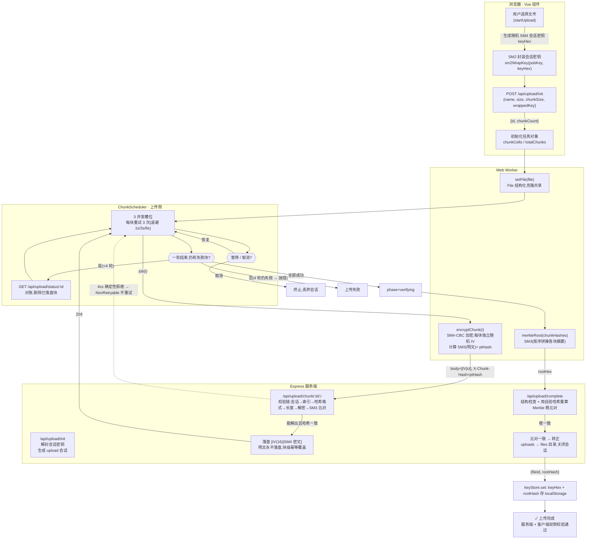
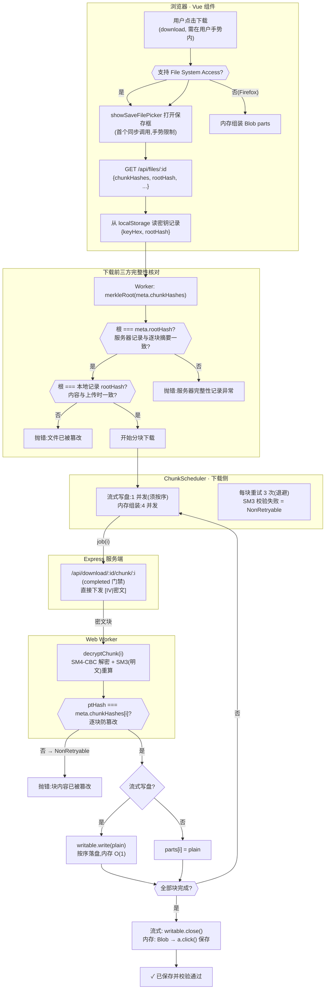

# 国密文件柜 · SM 系列算法浏览器端加密传输演示

浏览器端(Vue 3 + 原生 JS)通过**国密算法**对文件**分块加密上传 / 解密下载**,带**逐块与文件级双重完整性校验**;服务端 Node.js + Express。面向大文件:Web Worker + 4 MiB 分块 + 并发传输,主线程不阻塞、浏览器不崩溃。

```
SM2 密钥封装 ──→ SM4-CBC 分块加密 ──→ SM3 逐块校验 ──→ Merkle 根比对
  (会话密钥分发)   (每块独立随机 IV)    (上传/下载双向)   (文件级完整性锚点)
```

## 快速开始

```bash
npm install
npm run dev            # 开发:Vite middleware 单进程 + HMR → http://localhost:3900
npm run build          # 构建前端到 dist/
npm start              # 生产:服务 dist/(SM_DATA_DIR 可指定数据目录,PORT 可改端口)
npm run preview        # 本地预览构建产物
```

测试:

```bash
npm test               # 算法 KAT + 互操作 + 黑盒全链路(18 个用例,自动起进程内服务)
npm run smoke          # 真实浏览器(headless Chrome + CDP)全流程冒烟,需先启动服务
```

## 加密设计 · 加密传输流程图

> 上传与下载两套完整流程,标注了 客户端 / Worker / 服务端 三方职责与校验时机。
> 文件结构对应真实代码:上传见 `web/secure/upload-manager.js`,下载见 `web/secure/download-manager.js`,调度见 `web/secure/scheduler.js`,服务端路由见 `server.js`。

### 上传(加密上传 + 完整性校验)



### 下载(解密下载 + 三方完整性核对)



### 关键校验点一览

| # | 阶段 | 校验 | 失败后果 |
|---|---|---|---|
| 1 | 上传逐块 | 服务端解封密钥 → SM4 解密 → SM3(明文) 比对 `X-Chunk-Hash` | 422 拒绝,`NonRetryable` 不重试 |
| 2 | 上传转正 | 服务端用自验的逐块哈希重算 Merkle 根,与客户端提交比对 | 409,不转正 |
| 3 | 下载前 | Worker 用服务器返回的 chunkHashes 重算 Merkle 根,与服务器 rootHash **及** localStorage 三方交叉核对 | 抛错,拒绝下载 |
| 4 | 下载逐块 | Worker 解密后重算 SM3,与 `meta.chunkHashes[i]` 比对 | `NonRetryable`,下载失败 |

## 其他要点

- **明文永不落盘**:服务端只存 `[IV(16) | SM4 密文]`;SM4 会话密钥只在内存中解封用于校验,落盘 meta 里只有 SM2 封装形态。
- **上传幂等**:每块加密结果缓存(`cipherCache`),重试复用同一 IV + 密文 + 哈希,服务端覆盖写结果一致 —— 网络丢包/断点续传安全。
- **四轮调度兜底**:块上传成功但响应丢失时,一轮结束后 `GET /status` 对账剔除已落盘块,只补传残留(见上传图 RECON)。
- **断点续传**:服务器每块原子持久化 meta;恢复上传先对账,跳过已落盘块。
- **手势限制**:`showSaveFilePicker` 必须是下载函数首个同步调用(浏览器要求在用户手势内打开保存框)。
- **密钥本地化**:SM4 密钥只存本浏览器 localStorage(`sm-vault-keys`),换浏览器/清除站点数据即无法解密。

### 信任模型:加密传输 + 密文落盘 + 服务端可验

- **SM2** 负责密钥分发:客户端每次上传生成随机 16 字节 SM4 会话密钥,用服务器 SM2 公钥封装(`doEncrypt`,cipherMode=1 / C1C3C2,国标推荐)随上传初始化请求发送。服务器持私钥,启动时生成并持久化 `data/keypair.json`。
- **SM4-CBC** 负责分块加密:4 MiB 一块,**每块独立随机 IV**(16 字节,`crypto.getRandomValues`),PKCS#7 填充;块间 CBC 完全独立,单块损坏不影响其它块。
- **SM3** 负责完整性:每块明文摘要随上传请求头 `X-Chunk-Hash` 发送,服务器解密后比对,不符即 422 拒绝;下载时客户端逐块重算比对。
- **Merkle 根**负责文件级完整性:`rootHash = SM3(按序拼接各块 32 字节原始摘要)`。两端均可增量计算,无需一次性哈希整个文件。上传完成后服务器比对客户端提交的根,一致才转正;下载时客户端与服务器 meta、以及**上传时存入 localStorage 的根三方交叉核对**——服务器被篡改(连 meta 一起改)也会被发现。
- **明文永不落盘**:服务器只存 `[IV(16) | 密文]` 块文件,SM4 密钥只以 SM2 封装形态存 meta,仅在校验瞬间解封于内存。下载通道传输的就是密文,网络窃听者无会话密钥即无法读取。

### 大文件策略

| 机制 | 实现 |
|---|---|
| 分块 | 4 MiB/块(服务端校验 1–16 MiB),10 GB 文件仅 2560 块 |
| Worker | 所有加解密与 SM3 在 module Worker 执行(Vite 打包),File 结构化克隆共享存储、分块读取在 Worker 内完成;ArrayBuffer 双向 Transferable 零拷贝 |
| 并发 | 上传 3、下载 4(内存模式);失败重试 3 次指数退避(1s/3s/8s)+ 每块 60s 超时,重试复用同一密文(幂等覆盖) |
| 断点续传 | 暂停/恢复/取消;恢复先 `GET /status` 对账,跳过已落盘块;服务器每块原子持久化 meta,重启后仍可续传 |
| 下载写盘 | 优先 File System Access API 流式写盘(内存 O(1));不支持时(Firefox)Blob parts 内存组装,>1 GB 建议换 Chrome/Edge |
| 可靠性 | 块文件 `.tmp`+rename 原子写;服务器 per-chunk SM3 已在接收时校验,complete 只做结构检查 + Merkle 根比对 |

## 目录结构

```
index.html                Vite 入口:极简壳(仅挂载点 #app + 引导脚本),模板与样式在 App.vue
vite.config.js            Vite 配置:@vitejs/plugin-vue(SFC 构建期编译,runtime 构建)+ sm-crypto 的 crypto stub
web/App.vue               Vue 根组件(SFC,Options API):模板 + 全局样式 + 页面逻辑(UI 状态、事件委托、协议条、模板辅助)
web/main.js               挂载引导:createApp(App).mount('#app');传输逻辑只经请求加密库入口引入
web/secure/               请求加密库(自包含,唯一入口 index.js;main.js 不感知内部拆分)
web/secure/index.js       库门面 createSecureClient({callbacks}) → { fetchPubkey/listFiles/removeFile/
                         getKey/hasKey/removeKey/startUpload/pause/resume/cancel/download };另导出 format 函数
web/secure/upload-manager.js   上传编排:密钥协商 → 分块加密上传 → 四轮调度+对账 → Merkle 校验(经回调同步 UI)
web/secure/download-manager.js 下载编排:流式写盘/内存组装 → 三方完整性核对 → 逐块解密校验
web/secure/worker-client.js    Worker 客户端:请求-响应关联封装(发任务 → Promise 回包)
web/secure/scheduler.js        通用分块调度器:并发槽位 + 指数退避重试 + 暂停/取消(NonRetryable 快速失败)
web/secure/http.js             HTTP 基础设施:api(JSON/错误语义)、fetchWithTimeout、sleep(可中断)
web/secure/keystore.js         localStorage 密钥管理(get/set/remove 会话密钥 + Merkle 根)
web/secure/format.js           展示格式化:formatBytes/formatSpeed/formatTime/formatTimeShort/shortHex
web/secure/worker.js           module worker(ESM):加密/解密/SM3/Merkle 执行入口
web/secure/worker-core.js      Worker 纯逻辑:消息协议 + 启动 KAT 自检(可脱离浏览器测试)
web/secure/crypto.js           全项目唯一算法封装(ESM:浏览器/Worker/Node 共用,测试复用)
web/shims/                sm-crypto 的 require('crypto') 浏览器 stub
public/favicon.svg        站点图标(Vite publicDir 静态资源)
server.js                 Express 应用:API 路由 + 静态服务(开发挂 Vite middleware,生产服务 dist/)
src/crypto-native.js      Node 原生 sm4-cbc/sm3 快路径(纯 JS 的 ~100 倍吞吐),带回退
src/store.js              磁盘存储:SM2 密钥对、上传会话、文件 meta;路径安全 + 原子写
src/sessions.js           上传会话密钥管理(仅驻留内存,meta 只存 SM2 封装形态)
scripts/browser-smoke.mjs headless Chrome + CDP 全流程冒烟
test/crypto.test.mjs      算法 KAT + sm-crypto 与 Node 原生互操作(字节级一致)
test/worker.test.mjs      Worker 核心协议(直接驱动 worker-core,无需构建产物)
test/e2e.mjs              黑盒全链路:往返/边界/篡改/续传/负面用例
docs/encryption-flow.md   上传/下载加密请求流程图(Mermaid:密钥协商、分块加密、完整性校验时机)
```

## API

| 方法 | 路径 | 说明 |
|---|---|---|
| GET | `/api/pubkey` | SM2 公钥 + 指纹 |
| POST | `/api/upload/init` | `{name, size, chunkSize, wrappedKey}` → `{id, chunkCount}`;解封会话密钥 |
| POST | `/api/upload/chunk/:id/:index` | 头 `X-Chunk-Hash` = SM3(明文),体 `[IV(16)\|SM4 密文]`;解密比对,不符 422 |
| GET | `/api/upload/status/:id` | 已落盘块索引(断点续传对账) |
| POST | `/api/upload/complete` | `{id, rootHash}`;结构检查 + Merkle 根比对,通过后转正 |
| GET | `/api/files` / `/api/files/:id` | 文件列表 / 全量 meta(逐块摘要、根、封装密钥) |
| GET | `/api/download/:id/chunk/:index` | 密文块(completed 门禁) |
| DELETE | `/api/files/:id` | 删除文件 |

## 安全性说明与已知局限

- **哈希头未做 HMAC**:主动 MITM 可同时改写密文与哈希头;本方案防御传输窃听与服务器数据被篡改(有 localStorage 根交叉核对),生产环境仍应叠加 TLS。应用层加密 ≠ 替代 TLS。
- **密钥存 localStorage**:刷新后可免密解密,换浏览器/清除站点数据即无法解密(界面会明确提示)。这是"加密传输"模型下免密体验的取舍,若要零信任 E2E(服务端不可信),可扩展为密码派生密钥(如 SM3 迭代 KDF + 服务端仅存盐),届时服务器将无法做上传内容校验。
- **服务端可解封会话密钥**:服务器持有 SM2 私钥,设计上可以解密校验;不落盘明文只是约定。信任边界是"服务器可信"。
- Firefox 无 File System Access API,大文件下载走内存组装。
- 上传会话密钥驻留服务端内存,进程重启后从 meta 重新解封;超过 24 小时的未完成上传在服务端启动时清理。
- 浏览器端 SM4 为纯 JS 实现(约 10–30 MB/s/线程),大文件加密耗时主要在这;生产可换 WebAssembly 实现提速。

## 测试覆盖

- **算法层**:SM3 公开测试向量 KAT;SM4 多长度往返(含 4 MiB 整倍数与 PKCS#7 全块填充);SM2 封装/解封往返;**纯 JS 与 Node 原生 sm4-cbc/sm3 双向互操作字节级一致**(服务端快路径的兼容性保障);Merkle 根确定性与顺序敏感性;密文长度公式与 sm-crypto 实际输出对拍。
- **Worker 层**:直接驱动 worker-core 的消息协议(KAT 自检、加解密、Merkle、错误路径),与浏览器端 module worker 行为等价。
- **黑盒全链路**(进程内服务):基础往返逐字节比对;边界尺寸(0B/17B/16B/恰 4MiB/4MiB+1/8MiB+3);**篡改检测**(改落盘密文 1 字节 → 下载校验必须失败);断点续传对账;负面用例(错哈希 422、缺块 400、未知 id 404、半成品不可下载)。
- **真实浏览器冒烟**(headless Chrome + CDP):页面挂载 → 注入 24 MiB 文件 → 暂停/继续 → 加密上传 → 转正 → 密钥落库 → 下载解密 → **落盘字节与源文件完全一致**,全程控制台零错误。
